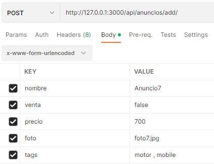
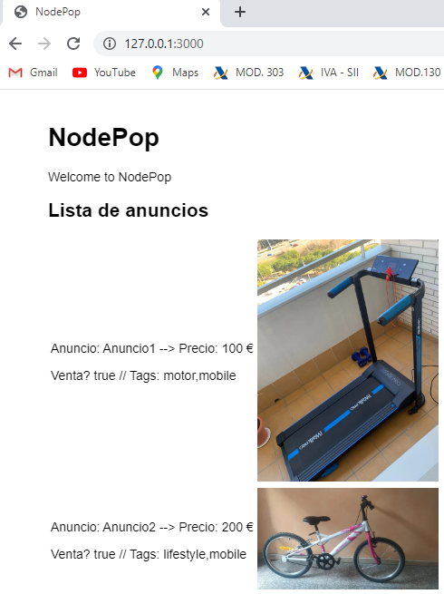
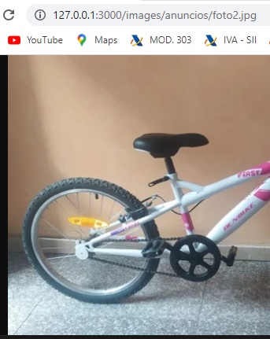

*************************
#  NodeJS practice
*************************
Student: Xavi Roca 
(26.FEB.23)

## Prerequisites

* NodeJS ([nodejs.org](https://nodejs.org/en/))
* MongoDB ([mongodb.com](https://www.mongodb.com/))


* Packages:
  * express --> `npm i express` ... ([expressjs.com](https://expressjs.com/))
  * nodemon --> `npm i nodemon`
  * ejs --> `npm i ejs`
  * cross-env --> `npm i cross-env`
  * express-validator --> `npm i express-validator`
  * mongoose --> `npm i mongoose` ... ([mongoosejs.com](https://mongoosejs.com/))

  


## Nodepop

App directory
```sh
cd nodepop
```

Install dependencies with:
```sh
npm install
```

Initialize the database `pactica`:
```sh
npm run initDB
```

Start in development mode:
```sh
npm run dev
```

## API 

Here you are the three the endpoints that Nodepop app offers
### `anuncios` list

* URL: http://127.0.0.1:3000/api/anuncios
* You can apply some parameters:
  * Filters:
    * `nombre` -->  `...?nombre=text` ... return all element which nombre starts with `text`
    * `venta`-->  `...?venta=true` ... the value could be `true`or `false`
    * `precio` -->  `...?precio=regular_expresion` ... regular_expresion could be:
      * X ... exact value
      * X- ... great or equal x
      * -X ... less or equal x
      * X-Y ... between x and y, both included 
    * `tags`--> key word is `tag` (singular). Due to `tags`field is an array of strings user can ask for more than one value, per instance: `?tag=motor&tag=work`
  * Sort --> `...?sort=precio` or  `...?sort=-precio` 
  * Pagination --> `...?skip=10&limit=15` ... returns 15 elements starting at record 11. 
  * Fields -->  `...?fileds=nombre precio`
* Yo can combine some parameters and filters

### `tags` list

* Call without parameters: http://127.0.0.1:3000/api/anuncios/tags
* Result: all tags used
* ```js
    const query = Anuncio.distinct('tags');
    return query.exec();
    ```


### New `anuncio`

* It's a POST call where data comes in the body
* Call: http://127.0.0.1:3000/api/anuncios/add
* Sample data:


## WEB

Here you are the two different web pages
### Dinamic page: `anuncios` list

* URL: http://127.0.0.1:3000/
* It's possible to apply the same filters and parameters as `/api/anuncios` endpoint
  * http://127.0.0.1:3000?precio=200-300&sort=-precio ...




### Static pages: direct access to pictures

* URL: http://127.0.0.1:3000/images/anuncios/foto2.jpg



## ESLINT execution

* npx slint nodepop/**
* output file with errors I don't know how to solve ...

```sh
D:\KeepCoding\05.Backend-NodeJS\PracticaNodeJS\nodepop\app.js
  15:28  error  '__dirname' is not defined        no-undef
  25:34  error  '__dirname' is not defined        no-undef
  44:33  error  'next' is defined but never used  no-unused-vars

D:\KeepCoding\05.Backend-NodeJS\PracticaNodeJS\nodepop\bin\www
  15:26  error  'process' is not defined  no-undef
  69:7   error  'process' is not defined  no-undef
  73:7   error  'process' is not defined  no-undef

D:\KeepCoding\05.Backend-NodeJS\PracticaNodeJS\nodepop\package-lock.json
  2:9  error  Parsing error: Unexpected token :

D:\KeepCoding\05.Backend-NodeJS\PracticaNodeJS\nodepop\package.json
  2:9  error  Parsing error: Unexpected token :

D:\KeepCoding\05.Backend-NodeJS\PracticaNodeJS\nodepop\public\images\anuncios\foto1.jpg
  1:1  error  Parsing error: Unexpected character '�'

D:\KeepCoding\05.Backend-NodeJS\PracticaNodeJS\nodepop\public\images\anuncios\foto2.jpg
  1:1  error  Parsing error: Unexpected character '�'

D:\KeepCoding\05.Backend-NodeJS\PracticaNodeJS\nodepop\public\images\anuncios\foto3.jpg
  1:1  error  Parsing error: Unexpected character '�'

D:\KeepCoding\05.Backend-NodeJS\PracticaNodeJS\nodepop\public\images\anuncios\foto4.jpg
  1:1  error  Parsing error: Unexpected character '�'

D:\KeepCoding\05.Backend-NodeJS\PracticaNodeJS\nodepop\public\stylesheets\style.css
  1:6  error  Parsing error: Unexpected token {

D:\KeepCoding\05.Backend-NodeJS\PracticaNodeJS\nodepop\routes\index.js
  4:8   error  'query' is assigned a value but never used             no-unused-vars
  4:15  error  'validationResult' is assigned a value but never used  no-unused-vars

D:\KeepCoding\05.Backend-NodeJS\PracticaNodeJS\nodepop\routes\users.js
  5:36  error  'next' is defined but never used  no-unused-vars

D:\KeepCoding\05.Backend-NodeJS\PracticaNodeJS\nodepop\views\error.ejs
  1:1  error  Parsing error: Unexpected token <

D:\KeepCoding\05.Backend-NodeJS\PracticaNodeJS\nodepop\views\index.ejs
  1:1  error  Parsing error: Unexpected token <

✖ 18 problems (18 errors, 0 warnings)
```

*************************
#  Advanced Backend NodeJS -  practice
*************************
Student: Xavi Roca 
(28.MAY.23)

## Prerequisites

* Packages:
  * node-jsonwebtoken (auth0.com) --> `npm i node-jsonwebtoken` ... ([auth0.com](https://auth0.com/))
  * bcrypt --> `npm i bcrypt` (encriptación de passwords)
  * dotenv --> `npm i dotenv` (almacenamiento variables de entorno)

## Challenge: Authentication

JWT authentication on API

User : user@example.com / 1234


